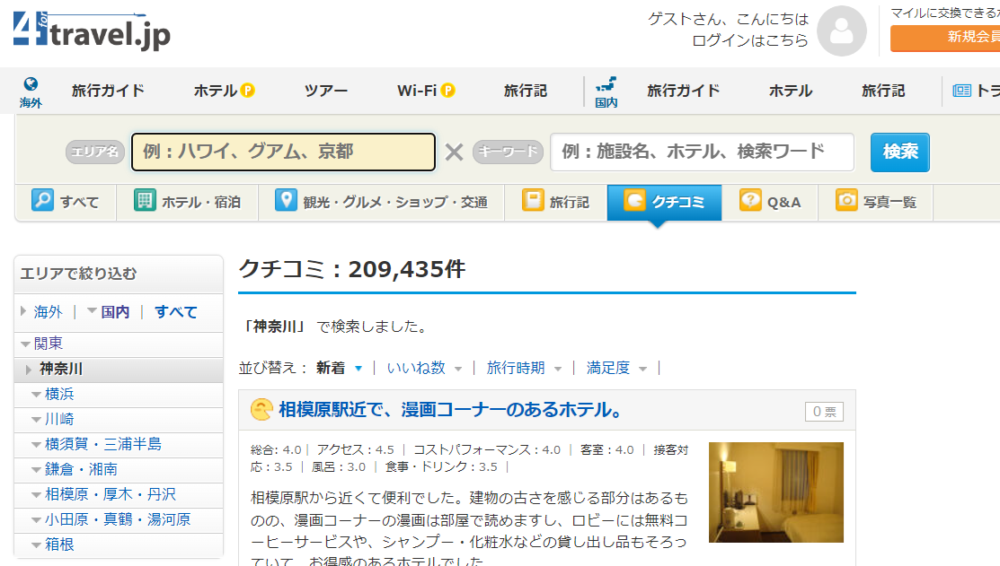

# fortravel dataset


1. mongoDBへのデータベースリストア
　以下のリストアの手順でやってください。このリンク記事の
　「dump restoreツールのインストール」の1. 3.   が該当になります。
　　
　https://github.com/uhokuto/mongodb/blob/main/mongodb.md  
　
　なお、restore対象のバックアップデータは、以下のリンクからダウンロードしてください。このfortravelDB2024というフォルダが、データベースそのものですのでこのままの名前でrestoreしてください。

　https://drive.google.com/drive/folders/1eBKhuEAE6nPiv1Tsc79c4CcmjhfQLPvz?usp=sharing

2. データベースのレイアウト

DB名　"fortravelDB2024"  
collection名　'fortravel_reviews'

```python
{'_id': ObjectId('669d775d2c6e9777a0ea09db'),
 'body': '熊谷駅から歩いて5分前後の場所にあります。おそらく築10年以上経っているのではないでしょうか。外観や内装が少し古 さを感じます。地方のホテルらしくこじんまりとしていて全体的に落ち着いています。駅周辺なので近くにいろいろなお店もあるので便利です。',
 'date': '旅行時期：2000-02-01',
 'eval': '総合:3.0｜アクセス：3.0｜コストパフォーマンス：3.0｜客室：3.0｜接客対応：3.0｜風呂：3.0｜食事・ドリンク：3.0｜バリアフリー：3.0',
 'pref': '埼玉',
 'spot_info': 'エリア：熊谷(埼玉)カテゴリー：宿・ホテル',
 'spot_link': 'https://4travel.jp/dm_hotel-10043353',
 'spot_name': 'スマイルホテル熊谷',
 'title': '簡素なホテル。'}
 ```

3. データ件数など
　174,827件  
   '埼玉',  '鎌倉・湘南',   '京都' の3エリア

3. fortravel クローラープログラム[forTravel_crawler2.py](forTravel_crawler2.py)

- 以下のページに都道府県名を入力して検索結果をクローリングするもの。

https://4travel.jp/search/review/dm?sa=%E4%BA%AC%E9%83%BD&sk=&order=desc&search_box_post_flag=1
なお、検索キーワードは以下の左サイドウインドウのエリア名を指定すると、該当エリアを網羅的に収集できる


- クローリングデータはそのまま上記2.のデータベースに書き出す
- 上記レイアウトの’pref'：のところに検索キーワードが格納される

- その他、mongoDBから全件取り出して画面表示するプログラムも用意した[get_alldata_mongo.py](get_alldata_mongo.py)
